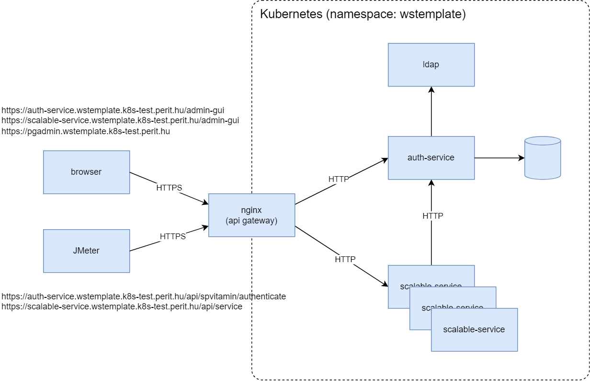
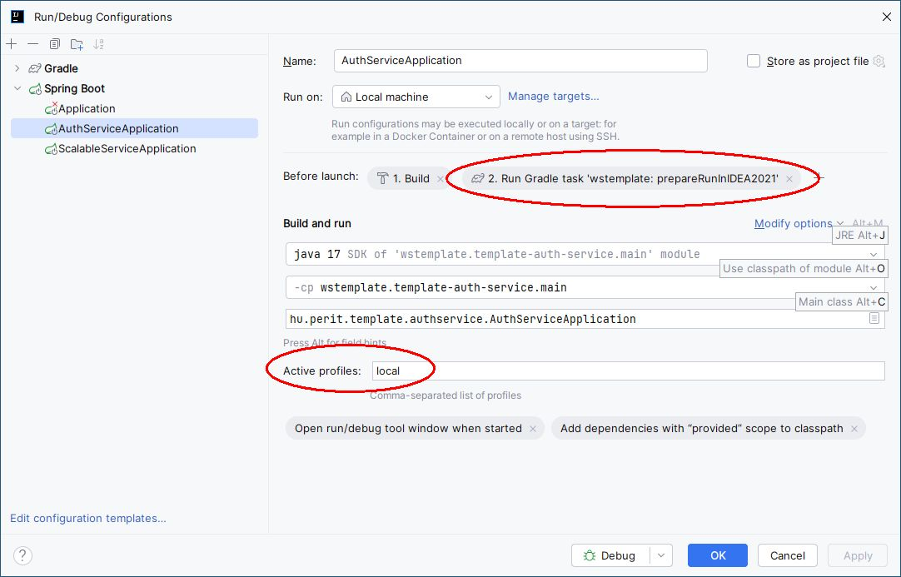
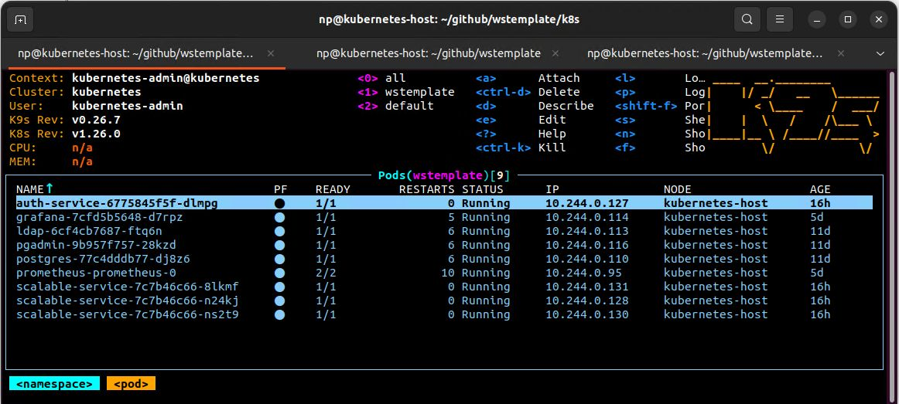
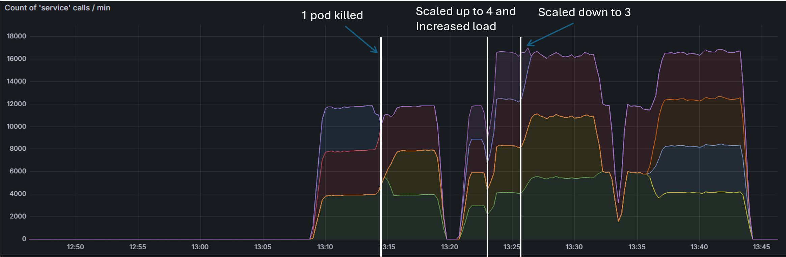

# wstemplate

This is a **sample project** for demonstrating the usage of the `spvitamin` library. 

Please visit the [**Microservice Development Guideline**](https://github.com/nagypet/wstemplate/wiki) for detailed instructions.

Contents:
<!-- TOC -->
* [wstemplate](#wstemplate)
  * [Architecture](#architecture)
  * [Building and running the samples](#building-and-running-the-samples-)
    * [Running the services in IDEA](#running-the-services-in-idea)
    * [Building docker images](#building-docker-images)
    * [Deployment in K8s](#deployment-in-k8s)
  * [Monitoring](#monitoring)
  * [Open issues](#open-issues)
<!-- TOC -->

## Architecture


## Building and running the samples 

There are 2 main components of the system:
- template-auth-service: an authorization and user management service with Jwt authentication
- template-scalable-service: 3 instances of the service are installed to achieve scalability and high availability.


### Running the services in IDEA




### Building docker images
- The build scripts will create the docker images and push them in a repository for use within the Kubernetes cluster. I have used `docker-registry:5000`, but you can customize this in build.gradle.
- cd to the root folder and
```
gradlew clean dockerImage
```

### Deployment in K8s

The manifests are located in the /k8s folder.

```
kubectl apply -f .
```

When the containers are up and running, go to http://pgadmin.wstemplate.k8s-test.perit.hu for pgadmin. 
- login with postgres/sa
- create a new connection. Parameters: host: postgres, port: 5432, username: postgres, password: sa
- create a new database with the name 'testdb'. 
- run the script in db\scripts.sql

Check if all container is up and running.



Start JMeter and load the script jmeter/wstemplate.jmx.

## Monitoring
Go to http://grafana.wstemplate.k8s-test.perit.hu for Grafana. Login with admin/admin.


## Open issues
- Hogyan kezeljük a service-ekben a tanusítványokat? Kívülről https-en keresztül kell őket elérni, ehhez kell egy keystore.jks és egy trustrore.jks, amelyik rendszeresen, automatikusan frissítve van.
- Hogyan oldjuk meg az authentikációt, hogy függetlenek legyünk az adott szervezet konkrét authentikációs mechanizmusaitól?
