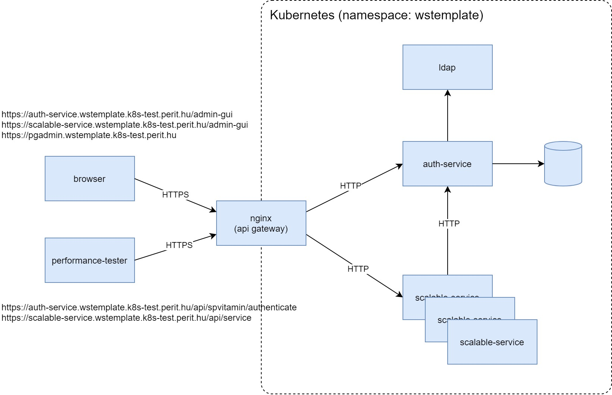

# wstemplate

This is a sample project for the [Microservice Development Guideline](https://github.com/nagypet/wstemplate/wiki).

## Building and running the samples 

### Architecture


There are 3 main components of the system:
- template-auth-service: an authorization and user management service with Jwt authentication
- template-scalable-service: 3 instances of the service are installed to achieve scalability and high availability.
- performance-tester: to generate a simulated load for the system

### Prerequisits
Install AdoptOpenJDK 11
```
wget -qO - https://adoptopenjdk.jfrog.io/adoptopenjdk/api/gpg/key/public | sudo apt-key add -
sudo add-apt-repository --yes https://adoptopenjdk.jfrog.io/adoptopenjdk/deb/
sudo apt install adoptopenjdk-11-hotspot
```
- Get the sources. Please note that the spvitamin library is availyble in the maven central repository, so you do not have to install in in source format. Getting the sources is only needed when developing the spvitamin library:
```
git clone https://github.com/nagypet/wstemplate.git
```
optional:
```
cd wstemplate
git submodule update --init
```

This project requires spvitamin 2.0.2-RELEASE or higher.

### Frontend
- Install Node.js
```
npm install -g @angular/cli
npm update
build.bat
```
Maybe you will need to update your local ng CLI:
```
npm install --save-dev @angular/cli@latest
```

### Backends
- The build scripts will create the docker images and push them in a repository for use within the Kubernetes cluster. I have used `docker-registry:5000`, but you can customize this in build.gradle.
- cd to the root folder and
```
gradlew clean dockerImage
```
When the containers are up and running, go to http://pgadmin.wstemplate.k8s-test.perit.hu for pgadmin. 
- login with postgres/sa
- create a new connection. Parameters: host: postgres, port: 5432, username: postgres, password: sa
- create a new database with the name 'testdb'. 
- run the script in db\scripts.sql

Check if all container is up and running.


Start the performance-tester in a command-line. The executables are located in performance-tester\build\install\performance-tester\bin\.
Or use the JMeter tester.

## Monitoring
Go to http://grafana.wstemplate.k8s-test.perit.hu for Grafana. Login with admin/admin.


## Know-how tags:
This chapter is not up-to-date!

Find the tags in the source code to see how it was made.

| Tag                                                                                 | Description                                                                                                                                                    |
|-------------------------------------------------------------------------------------|----------------------------------------------------------------------------------------------------------------------------------------------------------------|
| #know-how:access-spring-managed-beans-from-outside                                  | How can we access beans managed within the application context from outside of the context                                                                     |
| #know-how:custom-authentication-provider                                            |                                                                                                                                                                |
| #know-how:simple-httpsecurity-builder                                               | The WebSecurityConfigurerAdapter is a real pain in the ... We have SimpleHttpSecurityBuilder to simplify the security configuration.                           |
| [#know-how:custom-rest-error-response](#custom-rest-error-response)                 | In case of any exception in the server side we want to provide a useful HTTP body in Json form. This can be converted back to an Exception on the client side. |
| #know-how:hibernate-configuration                                                   | How to configure hibernate in the most flexible way?                                                                                                           |
| #know-how:jpa-auditing                                                              | How to configure custom auditing features to track creation/modification of entities?                                                                          |
| [#know-how:disable-ssl-certificate-validation](#disable-ssl-certificate-validation) | How to completely disable SSL certificate validation in the development environment?                                                                           |
| [#know-how:custom-zuul-error-filter](#custom-zuul-error-filter)                     | Custom Zuul error filter                                                                                                                                       |
| [#know-how:gc-timer](#gc-timer)                                                     | Forced garbage collection                                                                                                                                      |


### <a name="disable-ssl-certificate-validation"></a> #know-how:disable-ssl-certificate-validation
In a development environment often we do not have a signed certificate. We generate a self-signed one, just for encryption and do not want a validation. As long as only Feign or RestTemplate is in use for building a HTTP request, we can easily customize both of them to ignore certificate validation. But if many spring cloud services are in use, like Eureka, Ribbon, Zuul, etc., each and every of them have an own way of creating the request. We simply do not have as many time to switch off validation at all the components we have. So we need a general solution which grabs the problem at a lower layer: at the layer of `java.security.Provider`. We can easiliy implement a `NullSecurityProvider`, which points to our own factory methods to instantiate a `NullTrustManager`.
```java
public class NullSecurityProvider extends java.security.Provider {

    public NullSecurityProvider(String name, String versionStr, String info) {
        super(name, versionStr, info);

        put("TrustManagerFactory.PKIX", "hu.perit.spvitamin.spring.security.NullTrustManagerFactory$SimpleFactory");
        put("TrustManagerFactory.SunX509", "hu.perit.spvitamin.spring.security.NullTrustManagerFactory$SimpleFactory");
    }
}
```
For convenience we can implement `NullSecurityProviderConfigurer` and have a config key in our application.properties to easiliy allow or disable certificate validation.
```java
@Component
@Log4j
public class NullSecurityProviderConfigurer {

    private final ServerProperties serverProperties;

    public NullSecurityProviderConfigurer(ServerProperties serverProperties) {
        this.serverProperties = serverProperties;
    }

    @PostConstruct
    void init() {
        if (this.serverProperties.getSsl() != null && this.serverProperties.getSsl().isIgnoreCertificateValidation()) {
            Provider nullSecurityProvider = new NullSecurityProvider("NullSecurityProvider", "1.0", "Skipping SSL certificate validation");
            Security.insertProviderAt(nullSecurityProvider, 1);

            log.warn("NullSecurityProvider installed!");
        }
    }
}
```
### <a name="custom-zuul-error-filter"></a> #know-how:custom-zuul-error-filter
Having Zuul in our classpath we can easily implement an API gateway, to have a single access point for our microservice components. Without any further configuration we only receive the following response from the gateway, in case of an internal failure, which might be completely correct, but a little more information would be nice.
```
{
    "timestamp": "2020-08-16 09:39:58",
    "status": 500,
    "error": "Internal Server Error",
    "message": ""
}
```
Implementing our `CustomZuulErrorFilter` we will have a better response, like this:
```
{
    "timestamp": "2020-08-16 09:32:12.273",
    "status": 500,
    "error": "Internal Server Error",
    "path": "/authenticate",
    "exception": {
        "message": "Filter threw Exception",
        "exceptionClass": "com.netflix.zuul.exception.ZuulException",
        "superClasses": [
            "com.netflix.zuul.exception.ZuulException",
            "java.lang.Exception",
            "java.lang.Throwable",
            "java.lang.Object"
        ],
        "stackTrace": [
            {
                "classLoaderName": "app",
                "moduleName": null,
                "moduleVersion": null,
                "methodName": "processZuulFilter",
                "fileName": "FilterProcessor.java",
                "lineNumber": 227,
                "className": "com.netflix.zuul.FilterProcessor",
                "nativeMethod": false
            }
        ],
        "cause": {
            "message": "com.netflix.zuul.exception.ZuulException: Forwarding error",
            "exceptionClass": "org.springframework.cloud.netflix.zuul.util.ZuulRuntimeException",
            "superClasses": [
                "org.springframework.cloud.netflix.zuul.util.ZuulRuntimeException",
                "java.lang.RuntimeException",
                "java.lang.Exception",
                "java.lang.Throwable",
                "java.lang.Object"
            ],
            "stackTrace": [
                {
                    "classLoaderName": "app",
                    "moduleName": null,
                    "moduleVersion": null,
                    "methodName": "run",
                    "fileName": "RibbonRoutingFilter.java",
                    "lineNumber": 124,
                    "className": "org.springframework.cloud.netflix.zuul.filters.route.RibbonRoutingFilter",
                    "nativeMethod": false
                }
            ],
            "cause": {
                "message": "Forwarding error",
                "exceptionClass": "com.netflix.zuul.exception.ZuulException",
                "superClasses": [
                    "com.netflix.zuul.exception.ZuulException",
                    "java.lang.Exception",
                    "java.lang.Throwable",
                    "java.lang.Object"
                ],
                "stackTrace": [
                    {
                        "classLoaderName": "app",
                        "moduleName": null,
                        "moduleVersion": null,
                        "methodName": "handleException",
                        "fileName": "RibbonRoutingFilter.java",
                        "lineNumber": 198,
                        "className": "org.springframework.cloud.netflix.zuul.filters.route.RibbonRoutingFilter",
                        "nativeMethod": false
                    }
                ],
                "cause": {
                    "message": "Load balancer does not have available server for client: template-auth-service",
                    "exceptionClass": "com.netflix.client.ClientException",
                    "superClasses": [
                        "com.netflix.client.ClientException",
                        "java.lang.Exception",
                        "java.lang.Throwable",
                        "java.lang.Object"
                    ],
                    "stackTrace": [
                        {
                            "classLoaderName": "app",
                            "moduleName": null,
                            "moduleVersion": null,
                            "methodName": "getServerFromLoadBalancer",
                            "fileName": "LoadBalancerContext.java",
                            "lineNumber": 483,
                            "className": "com.netflix.loadbalancer.LoadBalancerContext",
                            "nativeMethod": false
                        }
                    ],
                    "cause": null
                }
            }
        }
    }
}
```
### <a name="gc-timer"></a> #know-how:gc-timer
Calling `System.gc()` is generally not recommended. But my applications have smaller memory footprint when calling gc() periodically. I have setup a scheduled job for calling gc() once in a minute, and see what happened:
| JVM Total | G1 Eden Space |
| ------ | ------ |
|  |  |


## Open issues
- Hogyan kezeljük a service-ekben a tanusítványokat? Kívülről https-en keresztül kell őket elérni, ehhez kell egy keystore.jks és egy trustrore.jks, amelyik rendszeresen, automatikusan frissítve van.
- Hogyan oldjuk meg az authentikációt, hogy függetlenek legyünk az adott szervezet konkrét authentikációs mechanizmusaitól?
